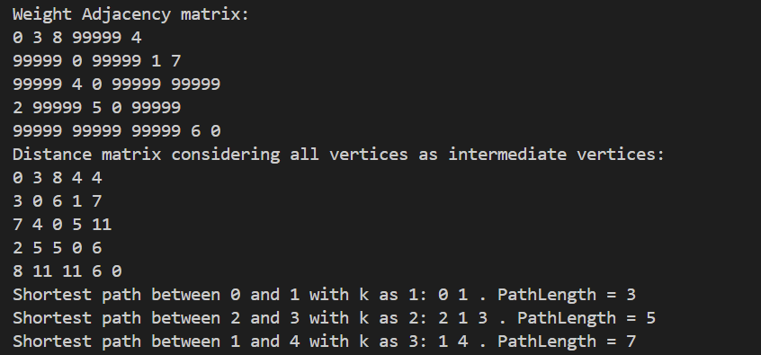

# All_Pairs_Shortest_path

Given a text consisting the weighted adjacency 
matrix for a graph G, computing the shortest path between every pair of vertices in G.
Implement Floyd-Warshall algorithm to the above task. Also storing the distance and predecessor
matrix to compute the shortest path i− > v1 . . . − > j where each interme-
diate vertex has an index at most k.

## OUTPUT:

